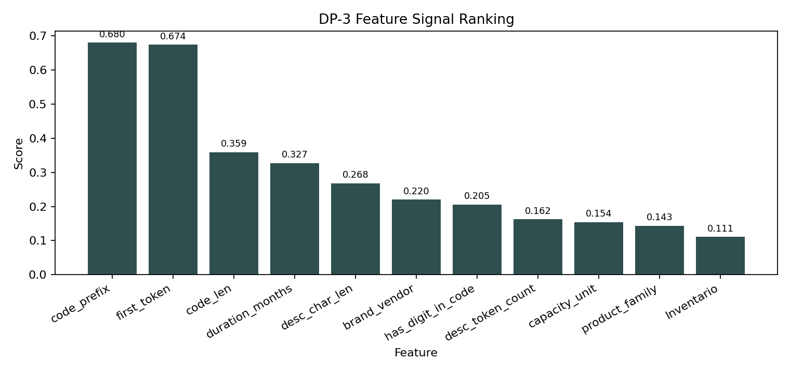
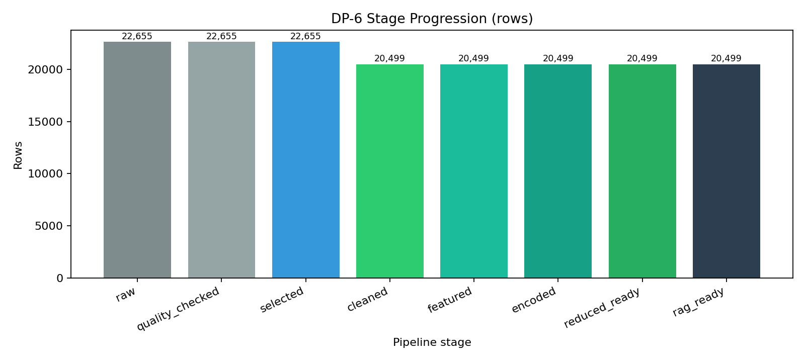

# EDA & Data Preparation Summary Report

**Project scope:** Classification of `Inventario` status and `Lob Associata` from product code and description data.

## 1) Initial Data and Business Glossary (Data Profiling)

**Data source**
- File: `DB for DTM Project.xlsx`
- Main sheet: `Associazioni Cod. Art. - LOB`

**Initial dataset profile**
- Rows: **22,655**
- Core fields: **5**

| Field | Business meaning | Modeling role | Type / quality |
|---|---|---|---|
| `Codice Articolo` | Product/article code | Input key feature | `object`, 22,655 non-null, 22,655 unique |
| `Descrizione Articolo` | Free-text product description | Input text feature | `object`, 22,595 non-null, 60 null (0.265%), 21,283 unique |
| `Lob Associata` | Line-of-business code | Primary classification target | `int64`, 22,655 non-null, 117 unique |
| `Nome LOB` | Human-readable LOB name | Input metadata / validation field | `object`, 22,655 non-null, 115 unique |
| `Inventario` | Inventory class label | Secondary target | `object`, 22,655 non-null, 3 classes |

**`Inventario` class distribution (raw)**
- `Inventario`: **19,764**
- `Non in inventario`: **2,880**
- `Assistenza`: **11**

## 2) What Drives Classification (Inventario Rules and Vendor Signal)

Feature signal ranking confirms that structured code and text anchors drive classification quality.

Top signals (`dp3_feature_signal.csv`):
- `code_prefix`: **0.680** (weighted purity)
- `first_token`: **0.674** (weighted purity)
- `code_len`: **0.359**
- `duration_months`: **0.327**
- `brand_vendor`: **0.220** (weighted purity)

Feature signal chart:

### Interpretable code-prefix rules (examples)
Derived from `freq_prefix_vs_lob.csv`.

| Rule | Support | Confidence |
|---|---:|---:|
| `prefix=AIR -> LOB 2001` | 243 | 0.938 |
| `prefix=UCS -> LOB 3009` | 202 | 0.944 |
| `prefix=WS -> LOB 2002` | 195 | 0.970 |
| `prefix=UCSC -> LOB 3009` | 136 | 0.986 |
| `prefix=NW -> LOB 3005` | 133 | 0.971 |

### Inventory keyword rules (examples)
Derived from `freq_keywords_vs_inventario.csv`.

| Rule | Support | Confidence |
|---|---:|---:|
| `keyword="-c" -> Inventario` | 291 | 0.986 |
| `keyword="normal" -> Inventario` | 154 | 0.939 |
| `keyword="factory integrated" -> Inventario` | 106 | 0.930 |
| `keyword="sw" -> Inventario` | 103 | 0.954 |
| `keyword="renew" -> Inventario` | 80 | 0.930 |

### Vendor effect
Vendor extraction is informative and not marginal:
- `brand_vendor` scored **0.220** in feature signal ranking.
- In EDA diagnostics, `first_token_brand_precision_proxy = 0.951695` on overlapping known-brand rows.
- Rows with recognized vendor label (`brand_vendor != unknown`): **6,710**.

## 3) Data Problems and How They Were Resolved

### Main quality issues detected (DU-4)
- `description_with_multiple_targets`: **271** (conflicting descriptions)
- `blank_description`: **61**
- `duplicate_rows_all_cols`: **0**
- `code_with_multiple_targets`: **0**

### Additional semantic issue (LOB naming consistency)
From `simple_checks/summary.txt`:
- `Nome LOB -> many LOB`: **2** problematic names
  - `BUILDING AUTOMATION`
  - `VIDEOSORVEGLIANZA`

### Resolution strategy (DP-2)
1. **Safe target relabeling** using `grouping_lob_autofix_safe.csv`
   - Raw rows relabeled: **54** (`fix_by_name_prefix2`)
   - Relabeled rows retained in final cleaned set: **49**

2. **Stage A pre-pruning** (source-driven)
   - Source LOB excludes (`78*`, `01003`, `01009`, `01015`, `01011`): **1,161**
   - Service rows marked as `Inventario`: **222**
   - LOB not in `LOB` catalog: **0**
   - Union pre-pruned: **1,383**

3. **Stage B pruning** (quality/label integrity)
   - `Assistenza` pruned: **11**
   - `Non usare` patterns pruned: **31**
   - Blank description pruned: **62**
   - Description-to-multi-target conflict rows pruned: **701**
   - Union pruned (Stage B): **773**

4. **Duplicates after pruning**
   - Removed: **0** (none found)

## 4) Associative Rules from Description Word Matrices

Association matrices were built as normalized conditional distributions `P(class | token)`.

### Token -> Vendor (`dp3_token_brand_matrix_norm.csv`)
High-confidence examples:
- `catalyst -> cisco` (**0.996**)
- `cisco -> cisco` (**0.983**)
- `hpe -> hpe` (**0.965**)
- `normal -> trend_micro` (**0.928**)
- `utp -> fortinet` (**0.906**)

### Token -> Product Family (`dp3_token_family_matrix_norm.csv`)
High-confidence examples:
- `subscription -> subscription` (**0.950**)
- `poe -> hardware` (**0.925**)
- `cable -> hardware` (**0.867**)
- `normal -> license_term` (**0.856**)

These matrices are directly usable as interpretable rule candidates and confidence features in hybrid auto/manual routing.

## 5) Final Analysis and Data Preparation Results

### Pipeline outcome
- Raw rows: **22,655**
- Final cleaned/model-ready rows: **20,499**
- Net reduction: **2,156 rows** (**9.52%**)

- `rag_input_dataset.csv`: **20,499 rows**, **14 columns**
- `rag_input_dataset_new.csv`: **20,499 rows**, **14 columns**

### Evidence from EDA graph
The row flow is confirmed by the stage progression chart generated from `dp6_stage_progression.csv`:

### Quantitative modeling readiness gains
From `dp5_uplift_summary.csv` and `dp5_uplift_delta.csv`:
- Accuracy: **0.1548 -> 0.2571** (**+0.1024**)
- Weighted F1: **0.1739 -> 0.3014** (**+0.1275**)
- Macro F1: **0.1118 -> 0.2109** (**+0.0991**)

From `dp5_pca_summary.csv`:
- Cumulative explained variance:
  - 1 component: **43.48%**
  - 2 components: **78.28%**
  - 3 components: **98.52%**

## Conclusion
The preparation pipeline removed label noise and ambiguous records, corrected safe LOB inconsistencies, and converted description/code patterns into interpretable signals. The resulting 20,499-row dataset is cleaner, traceable by rule, and measurably stronger for downstream classification and retrieval tasks.
